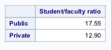

# Exploratory_Data_Analysis
This is the class project of my statistics course *Data Management and Graphics for Statistical Analyses*, which satisfies the General Education (GE) requirement in my Data Analysis specialization. The main focus of this project is about utilizing SAS along with its SQL procedure and macro programming for basic statistical analyses.

**Keywords**: SAS, SQL procedure, output delivery system, data wrangling, data visualization

## Outline
1. Understanding and Loading Data
2. SQL Procedure
3. Graphical Representation
4. Hypothesis Tests
5. Summary

## Understanding and Loading Data
The project is focusing on the data from 1995 US News Report on Colleges and Universities. Please see the readme text via the link http://www.amstat.org/publications/jse/datasets/usnews.txt for a description of the data and a list of the variables. The file is also available in this repository in csv format as **usnews.csv**.

Create a macro variable called *directory*. This macro variable will contain the directory path that points to the directory which will contain the files of interest for this project. Please note that I installed SAS student version with virtual environment under a folder called 'SASUniversityEdition'. 
```
* create a shortcut to external datasets;
%LET directory = /folders/myfolders/mySASCode/Final_Project/;
```

Then we can call the macro variable, and create a temporary library called *datapath* that links to the directory defined above. Next we can load the dataset as below.
```
LIBNAME datapath "&directory";
* load the dataset usnews.csv;
PROC IMPORT DATAFILE="&directory.usnews.csv"
			OUT=usnews
			DBMS=CSV
			REPLACE;
RUN;
```
**Suggestion**: make a copy of this dataset and use the copy throughout rather than modifying the original SAS dataset.

To better understand the dataset, we can create informative labels for the variables using the information from the readme text via the link indicated above. Then feel free to print out the table to test if labels are correct.
```
DATA usnews; SET usnews;
LABEL FICE = 'Federal ID number'
	  College = 'College name'
	  State = 'State (postal code)'
	  Priv_Pub = 'Public/private indicator'
	  Math_SAT = 'Average Math SAT score'
	  Verbal_SAT = 'Average Verbal SAT score'
	  SAT = 'Average Combined SAT score'
	  ACT = 'Average ACT score'
	  Q1Math = 'First quartile - Math SAT'
	  Q3Math = 'Third quartile - Math SAT'
	  Q1Verbal = 'First quartile - Verbal SAT'
	  Q3Verbal = 'Third quartile - Verbal SAT'
	  Q1ACT = 'First quartile - ACT'
	  Q3ACT = 'Third quartile - ACT'
	  AppReceived = 'Number of applications received'
	  AppAccepted = 'Number of applicants accepted'
	  Enrolled = 'Number of new students enrolled'
	  Pct_top10 = 'Pct. new students from top 10% of H.S. class'
	  Pct_top25 = 'Pct. new students from top 25% of H.S. class'
	  FTUndergrad = 'Number of full-time undergraduates'
	  PTUndergrad = 'Number of part-time undergraduates'
	  Tuition_In = 'In-state Tuition Costs ($)'
	  Tuition_Out = 'Out-of-state Tuition Costs ($)'
	  RoomBoard = 'Room and board costs'
	  Room = 'Room costs'
	  Board = 'Board costs'
	  Fees = 'Additional fees'
	  Book = 'Estimated book costs'
	  Personal = 'Estimated personal spending'
	  PhDFac = "Pct. of faculty with Ph.D.'s"
	  TermFac = 'Pct. of faculty with terminal degree'
	  Student_fac_ratio = 'Student/faculty ratio'
	  donate = 'Pct. alumni who donate'
	  Exp_per_student = 'Instructional expenditure per student'
	  Grad_rate = 'Graduation rate';
RUN;
```

## PROC SQL
􏰀PROC SQL is a very powerful Base SAS Procedure that combines the functionality of DATA and PROC steps into a single step. Using this command, we can sort, summarize, subset, join (merge), and concatenate datasets, create new variables, and print the results or create a new table or view all in one step.

For example, let's create a variable *goodmath* that is 1 if the school has an average Math SAT score above the Q3 Math SAT score and 0 otherwise. Similarly, we can create the variable *goodverbal* using the Average Verbal SAT score and Q3 Verbal SAT score.

```
PROC SQL;
	CREATE TABLE usnews_copy AS
	SELECT *,
		CASE
			WHEN Math_SAT = . THEN .
			WHEN Math_SAT > Q3Math THEN 1
			ELSE 0
		END AS goodmath,
		CASE
			WHEN Verbal_SAT = . THEN .
			WHEN Verbal_SAT > Q3Verbal THEN 1
			ELSE 0
		END AS goodverbal 
	FROM usnews;
RUN;
```
**Suggestion**: make sure to account for missing values.

Moreover, let's create a variable called *highgrad* that is a 1 for schools with graduation rates above the MEDIAN graduation rate and 0 otherwise.
```
PROC SQL;
	CREATE TABLE usnews_copy AS
	SELECT *,
		CASE
			WHEN Grad_rate = . THEN .
			WHEN Grad_rate > MEDIAN(Grad_rate) THEN 1
			ELSE 0
		END AS highgrad
	FROM usnews_copy;
RUN;
```

To make the table more readable, let's create appropriate formats for *goodverbal*, *goodmath*, and *highergrad* as well as the type of college/university (public or private).

```
PROC FORMAT;
     VALUE gv 1 = 'Verbal over 75th percentile'
              0 = 'Verbal under 75th percentile'
              . = 'Missing';
     VALUE gm 1 = 'Math over 75th percentile'
              0 = 'Math under 75th percentile'
              . = 'Missing';
     VALUE hg 1 = 'Graduation rate is ABOVE median'
              0 = 'Graduation rate is BELOW median'
              . = 'Missing graduate rate';
     VALUE PP 1 = 'Public'
     	      2 = 'Private';
RUN;
```

## Graphical Representation
Utilizing the labels and formats created above, let's make a table that displays the average tuition costs by *priv_pub*, for each of the categories in *goodverbal* (including a category for missing values). Within each of those *goodverbal* categories, we can show a breakdown in average tuition costs between in-state and out-of-state schools. Let's also repeat for the *goodmath* variable. The final two-dimensional table should display the results for both variables.
```
PROC TABULATE MISSING
	DATA = usnews_copy;
	CLASS Priv_Pub goodverbal goodmath;
	VAR Tuition_In Tuition_Out;
	FORMAT goodverbal gv. goodmath gm. highgrad hg. Priv_Pub PP.;
	TABLE Priv_Pub = '' , 
		  MEAN = '' * (goodverbal = 'Verbal SAT Score' * (Tuition_In Tuition_Out) 
		  goodmath = 'Math SAT Score' * (Tuition_In Tuition_Out))
		  /BOX = 'Average Tuition Costs';
RUN;
```


We can also make a table displaying the median student to faculty ratio for public/private schools to present the difference.
```
PROC TABULATE DATA=usnews_copy;
	CLASS Priv_Pub;
	VAR Student_fac_ratio;
	FORMAT Priv_Pub PP.;
	TABLE Priv_Pub = '', MEDIAN = '' * Student_fac_ratio;
RUN;
```


In addition, we can make a scatter plot of in-state tuition (X) versus out of state tuition (Y) with different colors representing public and private schools.
```
PROC SGPLOT DATA=usnews_copy;
	SCATTER X=Tuition_In Y=Tuition_Out / MARKERATTRS=(SYMBOL=CIRCLEFILLED) GROUP=Priv_Pub;
	FORMAT Priv_Pub PP.;
	KEYLEGEND / LOCATION=INSIDE POSITION=BOTTOMRIGHT ACROSS=1;
RUN;
```


From the plot, it can be seen that for private college/university, most of the data points indicate that in-state tuition is the same as out-of-state tuition. While for public college/university, almost all the data points suggest that in-state tuition is cheaper than out-of-state tuition.

Now let's take a closer look for the tuition of private schools, and fit a least-squares regression line with a band of 95% confidence limits and prediction limits.
```
* create a table with private schools only;
PROC SQL;
	CREATE TABLE usnews_Priv AS
	SELECT Tuition_In, Tuition_Out FROM usnews_copy WHERE Priv_Pub = 2;
RUN;
* scatter plot with fitted regression line for tuitions of private schools;
PROC REG DATA=usnews_Priv PLOTS(ONLY)=FITPLOT;
	MODEL Tuition_Out=Tuition_In;
RUN;
```


From the output tables, it can be seen that the fitted coefficients have been highlighted. Thus, the equation of this regression line is

<p align="center">out-of-state tuition(Y) = 192.49169 + 0.98507 × in-state tuition(X)</p>

Meanwhile, the t-value corresponding to the slope is 336.52 and its p-value is <0.0001. Thus, this indicates that we reject null hypothesis that slope=0 and conclude that in-state tuition is a significant predictor of out-of-state tuition for private schools.

## Hypothesis Testing
Aside from the above graphical representations, we can also use SAS for hypothesis testing. For example, are higher graduation rates (*highgrad*) associated with the type of college or university (*priv_pub*)? We can use Chi-square to test such association as follows.
```
PROC FREQ DATA=usnews_copy;
	FORMAT Priv_Pub PP. highgrad hg.;
	TABLES highgrad * Priv_Pub / CHISQ;
RUN;
```


The p-value for Chi-square statistic is <0.0001. Thus, at a signifance level of 0.05, we would reject the null hypothesis of no association and conclude that there is an association between higher graduation rates and the type of college or university.

## Summary
In this project, we utilized SAS for importing, merging, manipulating, formatting, labeling, calculating and summarizing of data. We aslo employed SQL Procedure and macro programming as well as investigated basic statistical analyses in SAS, including hypothesis testing, and its output delivery system for graphical representations of data.

If you have further questions or comments, please email: luyan461@gmail.com.
